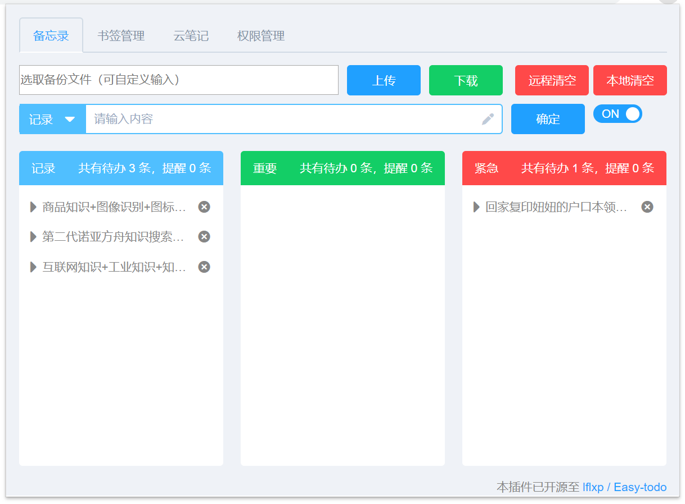
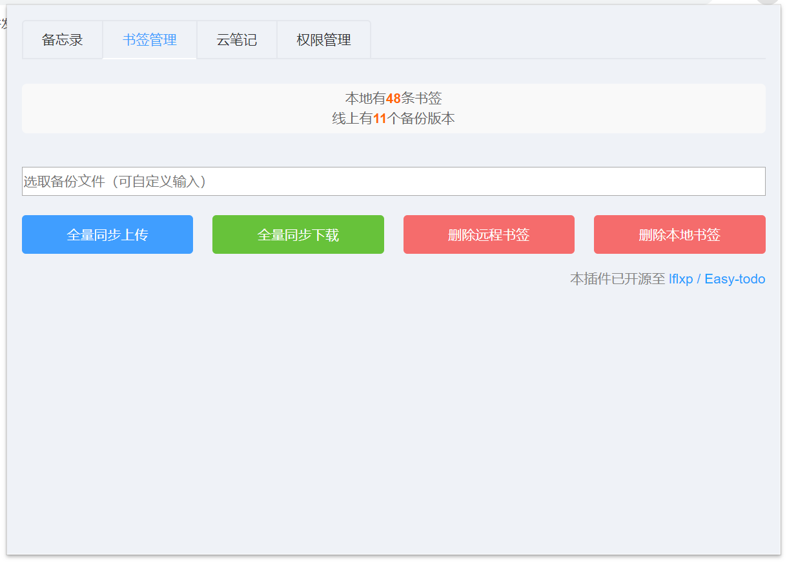
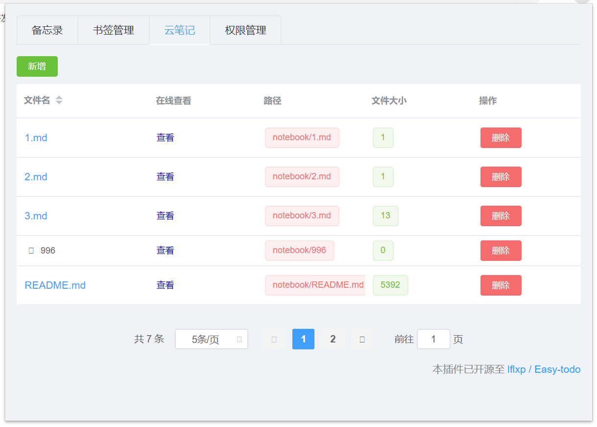
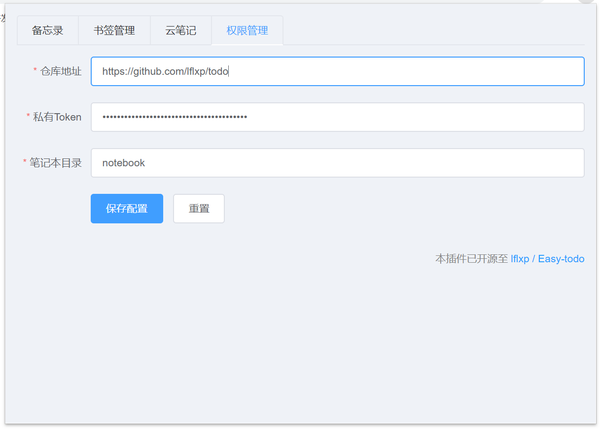

Easy todo
---

一个简洁高效的待办事项 chrome 扩展

### TODO

1. 新增github数据同步功能
2. 新增drag拖拽功能
3. 测试vue功能

### 功能

1. Chrome-extension 书签管理
2. TODO-LIST 管理
3. 云笔记

##### 插件主界面

### 功能介绍

待办事项设置，如果设置了提醒日期，在该提醒日期首次打开 chrome 时触发提醒通知。

### 如何使用

由于未能成功支付 chrome 商店的开发者注册费用，所以暂时不支持在线安装。

您可以下载或者克隆本仓库，打开谷歌浏览器，进入扩展程序，勾选`开发者模式`，点击`加载已解压的扩展程序`，选择本仓库的`dist`文件夹

# 帮助

如果有问题或者技术交流，请发邮箱联系: 382023823@qq.com
